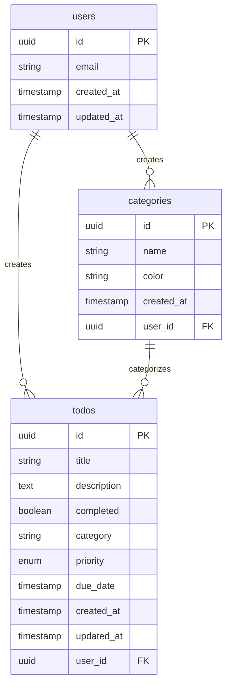

# 05. 数据库设计和安全策略

本章详细介绍 TodoList 应用的数据库设计原则、表结构设计、索引优化和安全策略配置。

## 🎯 学习目标

- 理解关系型数据库设计原则
- 掌握 PostgreSQL 表结构设计
- 学会配置行级安全策略 (RLS)
- 了解数据库性能优化技巧

## 🏗️ 数据库设计原则

### 1. 设计原则

- **规范化**: 减少数据冗余，提高数据一致性
- **性能优化**: 合理使用索引，优化查询性能
- **安全性**: 实施行级安全策略，保护用户数据
- **可扩展性**: 设计支持未来功能扩展的表结构
- **数据完整性**: 使用约束确保数据质量

### 2. 实体关系设计



## 📊 表结构设计

### 1. todos 表

```sql
-- 创建 todos 表
CREATE TABLE IF NOT EXISTS todos (
  id UUID DEFAULT gen_random_uuid() PRIMARY KEY,
  title TEXT NOT NULL CHECK (length(title) > 0 AND length(title) <= 200),
  description TEXT CHECK (length(description) <= 1000),
  completed BOOLEAN DEFAULT FALSE NOT NULL,
  category TEXT CHECK (length(category) <= 50),
  priority TEXT CHECK (priority IN ('low', 'medium', 'high')) DEFAULT 'medium' NOT NULL,
  due_date TIMESTAMPTZ,
  created_at TIMESTAMPTZ DEFAULT NOW() NOT NULL,
  updated_at TIMESTAMPTZ DEFAULT NOW() NOT NULL,
  user_id UUID REFERENCES auth.users(id) ON DELETE CASCADE NOT NULL
);

-- 添加注释
COMMENT ON TABLE todos IS '待办事项表';
COMMENT ON COLUMN todos.id IS '主键ID';
COMMENT ON COLUMN todos.title IS '标题，必填，最大200字符';
COMMENT ON COLUMN todos.description IS '描述，可选，最大1000字符';
COMMENT ON COLUMN todos.completed IS '是否完成';
COMMENT ON COLUMN todos.category IS '分类名称';
COMMENT ON COLUMN todos.priority IS '优先级：low, medium, high';
COMMENT ON COLUMN todos.due_date IS '截止日期';
COMMENT ON COLUMN todos.user_id IS '用户ID，外键';
```

**设计要点：**
- 使用 UUID 作为主键，避免 ID 冲突
- 添加 CHECK 约束确保数据质量
- 使用 TIMESTAMPTZ 存储时区信息
- 外键约束确保数据完整性

### 2. categories 表

```sql
-- 创建 categories 表
CREATE TABLE IF NOT EXISTS categories (
  id UUID DEFAULT gen_random_uuid() PRIMARY KEY,
  name TEXT NOT NULL CHECK (length(name) > 0 AND length(name) <= 50),
  color TEXT NOT NULL DEFAULT '#3B82F6' CHECK (color ~ '^#[0-9A-Fa-f]{6}$'),
  created_at TIMESTAMPTZ DEFAULT NOW() NOT NULL,
  user_id UUID REFERENCES auth.users(id) ON DELETE CASCADE NOT NULL,
  
  -- 确保同一用户的分类名称唯一
  UNIQUE(name, user_id)
);

-- 添加注释
COMMENT ON TABLE categories IS '分类表';
COMMENT ON COLUMN categories.name IS '分类名称，同一用户内唯一';
COMMENT ON COLUMN categories.color IS '分类颜色，十六进制格式';
```

**设计要点：**
- 复合唯一约束防止重复分类
- 颜色字段使用正则表达式验证格式
- 级联删除保持数据一致性

### 3. 触发器和函数

```sql
-- 创建更新时间触发器函数
CREATE OR REPLACE FUNCTION update_updated_at_column()
RETURNS TRIGGER AS $$
BEGIN
  NEW.updated_at = NOW();
  RETURN NEW;
END;
$$ language 'plpgsql';

-- 为 todos 表添加更新时间触发器
CREATE TRIGGER update_todos_updated_at 
  BEFORE UPDATE ON todos 
  FOR EACH ROW 
  EXECUTE FUNCTION update_updated_at_column();

-- 创建统计函数
CREATE OR REPLACE FUNCTION get_user_todo_stats(user_uuid UUID)
RETURNS JSON AS $$
DECLARE
  result JSON;
BEGIN
  SELECT json_build_object(
    'total', COUNT(*),
    'completed', COUNT(*) FILTER (WHERE completed = true),
    'active', COUNT(*) FILTER (WHERE completed = false),
    'overdue', COUNT(*) FILTER (WHERE completed = false AND due_date < NOW())
  ) INTO result
  FROM todos
  WHERE user_id = user_uuid;
  
  RETURN result;
END;
$$ LANGUAGE plpgsql SECURITY DEFINER;
```

## 🔒 行级安全策略 (RLS)

### 1. 启用 RLS

```sql
-- 启用行级安全策略
ALTER TABLE todos ENABLE ROW LEVEL SECURITY;
ALTER TABLE categories ENABLE ROW LEVEL SECURITY;
```

### 2. todos 表安全策略

```sql
-- 查看策略：用户只能查看自己的 todos
CREATE POLICY "todos_select_policy" ON todos
  FOR SELECT 
  USING (auth.uid() = user_id);

-- 插入策略：用户只能插入自己的 todos
CREATE POLICY "todos_insert_policy" ON todos
  FOR INSERT 
  WITH CHECK (auth.uid() = user_id);

-- 更新策略：用户只能更新自己的 todos
CREATE POLICY "todos_update_policy" ON todos
  FOR UPDATE 
  USING (auth.uid() = user_id)
  WITH CHECK (auth.uid() = user_id);

-- 删除策略：用户只能删除自己的 todos
CREATE POLICY "todos_delete_policy" ON todos
  FOR DELETE 
  USING (auth.uid() = user_id);
```

### 3. categories 表安全策略

```sql
-- 分类表的安全策略
CREATE POLICY "categories_select_policy" ON categories
  FOR SELECT 
  USING (auth.uid() = user_id);

CREATE POLICY "categories_insert_policy" ON categories
  FOR INSERT 
  WITH CHECK (auth.uid() = user_id);

CREATE POLICY "categories_update_policy" ON categories
  FOR UPDATE 
  USING (auth.uid() = user_id)
  WITH CHECK (auth.uid() = user_id);

CREATE POLICY "categories_delete_policy" ON categories
  FOR DELETE 
  USING (auth.uid() = user_id);
```

### 4. 管理员策略（可选）

```sql
-- 为管理员角色创建特殊策略
CREATE POLICY "admin_full_access_todos" ON todos
  FOR ALL
  TO authenticated
  USING (
    EXISTS (
      SELECT 1 FROM auth.users 
      WHERE auth.users.id = auth.uid() 
      AND auth.users.raw_app_meta_data->>'role' = 'admin'
    )
  );
```

## 📈 性能优化

### 1. 索引设计

```sql
-- 为 todos 表创建索引
CREATE INDEX IF NOT EXISTS idx_todos_user_id ON todos(user_id);
CREATE INDEX IF NOT EXISTS idx_todos_completed ON todos(completed);
CREATE INDEX IF NOT EXISTS idx_todos_category ON todos(category);
CREATE INDEX IF NOT EXISTS idx_todos_due_date ON todos(due_date);
CREATE INDEX IF NOT EXISTS idx_todos_priority ON todos(priority);
CREATE INDEX IF NOT EXISTS idx_todos_created_at ON todos(created_at DESC);

-- 复合索引用于常见查询
CREATE INDEX IF NOT EXISTS idx_todos_user_completed ON todos(user_id, completed);
CREATE INDEX IF NOT EXISTS idx_todos_user_category ON todos(user_id, category);

-- 为 categories 表创建索引
CREATE INDEX IF NOT EXISTS idx_categories_user_id ON categories(user_id);
CREATE INDEX IF NOT EXISTS idx_categories_name ON categories(name);

-- 部分索引（只为特定条件创建索引）
CREATE INDEX IF NOT EXISTS idx_todos_active ON todos(user_id, due_date) 
  WHERE completed = false;
```

### 2. 查询优化

```sql
-- 优化的查询示例
-- 获取用户的活跃 todos，按优先级和截止日期排序
EXPLAIN ANALYZE
SELECT id, title, priority, due_date, created_at
FROM todos
WHERE user_id = $1 
  AND completed = false
ORDER BY 
  CASE priority 
    WHEN 'high' THEN 1 
    WHEN 'medium' THEN 2 
    WHEN 'low' THEN 3 
  END,
  due_date NULLS LAST,
  created_at DESC
LIMIT 20;

-- 使用 CTE 优化复杂查询
WITH user_stats AS (
  SELECT 
    user_id,
    COUNT(*) as total_todos,
    COUNT(*) FILTER (WHERE completed = true) as completed_todos
  FROM todos
  WHERE user_id = $1
  GROUP BY user_id
),
recent_todos AS (
  SELECT *
  FROM todos
  WHERE user_id = $1
    AND created_at >= NOW() - INTERVAL '7 days'
  ORDER BY created_at DESC
  LIMIT 10
)
SELECT * FROM user_stats, recent_todos;
```

## 🔧 数据库函数和视图

### 1. 实用函数

```sql
-- 获取用户的 todo 统计信息
CREATE OR REPLACE FUNCTION get_todo_stats(user_uuid UUID)
RETURNS TABLE(
  total_count BIGINT,
  completed_count BIGINT,
  active_count BIGINT,
  overdue_count BIGINT,
  high_priority_count BIGINT
) AS $$
BEGIN
  RETURN QUERY
  SELECT 
    COUNT(*) as total_count,
    COUNT(*) FILTER (WHERE completed = true) as completed_count,
    COUNT(*) FILTER (WHERE completed = false) as active_count,
    COUNT(*) FILTER (WHERE completed = false AND due_date < NOW()) as overdue_count,
    COUNT(*) FILTER (WHERE priority = 'high' AND completed = false) as high_priority_count
  FROM todos
  WHERE todos.user_id = user_uuid;
END;
$$ LANGUAGE plpgsql SECURITY DEFINER;

-- 清理过期的已完成 todos
CREATE OR REPLACE FUNCTION cleanup_old_completed_todos()
RETURNS INTEGER AS $$
DECLARE
  deleted_count INTEGER;
BEGIN
  DELETE FROM todos
  WHERE completed = true
    AND updated_at < NOW() - INTERVAL '90 days';
  
  GET DIAGNOSTICS deleted_count = ROW_COUNT;
  RETURN deleted_count;
END;
$$ LANGUAGE plpgsql SECURITY DEFINER;
```

### 2. 视图

```sql
-- 创建 todo 详情视图
CREATE OR REPLACE VIEW todo_details AS
SELECT 
  t.id,
  t.title,
  t.description,
  t.completed,
  t.priority,
  t.due_date,
  t.created_at,
  t.updated_at,
  t.user_id,
  c.name as category_name,
  c.color as category_color,
  CASE 
    WHEN t.due_date IS NULL THEN false
    WHEN t.due_date < NOW() AND t.completed = false THEN true
    ELSE false
  END as is_overdue,
  CASE 
    WHEN t.due_date IS NULL THEN null
    WHEN t.due_date < NOW() THEN 'overdue'
    WHEN t.due_date < NOW() + INTERVAL '1 day' THEN 'due_soon'
    ELSE 'normal'
  END as urgency_status
FROM todos t
LEFT JOIN categories c ON t.category = c.name AND t.user_id = c.user_id;

-- 为视图启用 RLS
ALTER VIEW todo_details ENABLE ROW LEVEL SECURITY;

-- 为视图创建策略
CREATE POLICY "todo_details_select_policy" ON todo_details
  FOR SELECT 
  USING (auth.uid() = user_id);
```

## 🧪 数据库测试

### 1. 测试数据

```sql
-- 插入测试数据（仅在开发环境）
DO $$
DECLARE
  test_user_id UUID;
  work_category_id UUID;
  personal_category_id UUID;
BEGIN
  -- 假设有测试用户
  SELECT id INTO test_user_id FROM auth.users LIMIT 1;
  
  IF test_user_id IS NOT NULL THEN
    -- 插入测试分类
    INSERT INTO categories (name, color, user_id) VALUES
      ('工作', '#EF4444', test_user_id),
      ('个人', '#10B981', test_user_id)
    ON CONFLICT (name, user_id) DO NOTHING;
    
    -- 插入测试 todos
    INSERT INTO todos (title, description, category, priority, due_date, user_id) VALUES
      ('完成项目报告', '准备季度项目总结报告', '工作', 'high', NOW() + INTERVAL '2 days', test_user_id),
      ('买菜', '购买本周的食材', '个人', 'medium', NOW() + INTERVAL '1 day', test_user_id),
      ('学习新技术', '学习 Nuxt.js 3 新特性', '个人', 'low', NOW() + INTERVAL '1 week', test_user_id);
  END IF;
END $$;
```

### 2. 性能测试

```sql
-- 测试查询性能
EXPLAIN (ANALYZE, BUFFERS) 
SELECT * FROM todo_details 
WHERE user_id = 'test-user-id' 
  AND completed = false 
ORDER BY priority, due_date;

-- 测试索引使用情况
SELECT 
  schemaname,
  tablename,
  indexname,
  idx_scan,
  idx_tup_read,
  idx_tup_fetch
FROM pg_stat_user_indexes 
WHERE tablename IN ('todos', 'categories');
```

## 🎯 本章小结

在本章中，我们完成了：

1. ✅ **数据库设计**: 设计了规范化的表结构
2. ✅ **安全策略**: 配置了行级安全策略
3. ✅ **性能优化**: 创建了合适的索引
4. ✅ **数据完整性**: 添加了约束和触发器
5. ✅ **实用函数**: 创建了统计和清理函数
6. ✅ **测试验证**: 编写了测试数据和性能测试

## 🤔 思考题

1. 为什么使用 UUID 而不是自增 ID 作为主键？
2. 行级安全策略相比应用层权限控制有什么优势？
3. 如何平衡数据库规范化和查询性能？

## 📚 扩展阅读

- [PostgreSQL Documentation](https://www.postgresql.org/docs/)
- [Database Design Principles](https://en.wikipedia.org/wiki/Database_design)
- [PostgreSQL Performance Tuning](https://wiki.postgresql.org/wiki/Performance_Optimization)

## 🔗 下一章

[06. API 路由设计](./06-api-routes.md) - 学习如何设计和实现 RESTful API 路由。
